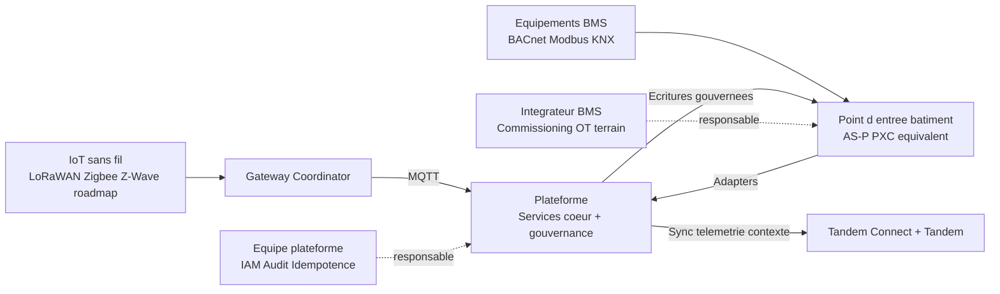

# One-Slide Actionnaires - Plateforme IoT + BMS + Digital Twin

## Message unique
La plateforme unifie l'IoT sans fil et le BMS filaire avec une gouvernance centrale des ecritures, tout en gardant le controle temps reel au niveau edge partenaire (AS-P, PXC, equivalents).

## Rappels de scope
- In scope: telemetrie IoT/BMS, gouvernance commandes, sync Tandem telemetrie/contexte.
- Hors scope actuel: commande depuis le jumeau numerique.
