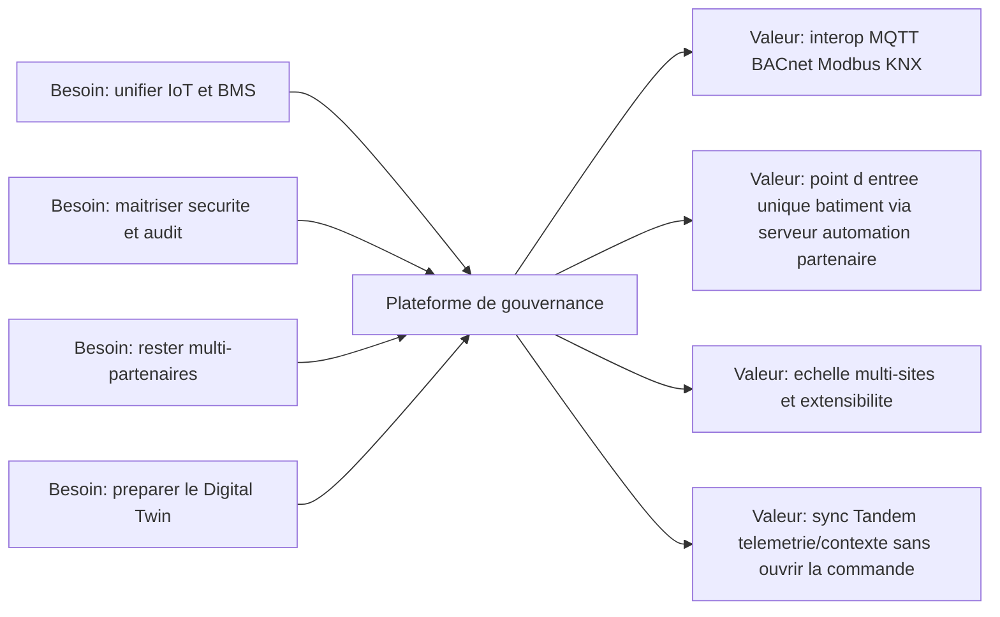
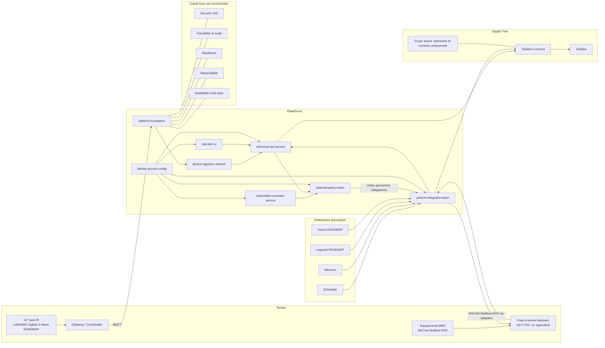
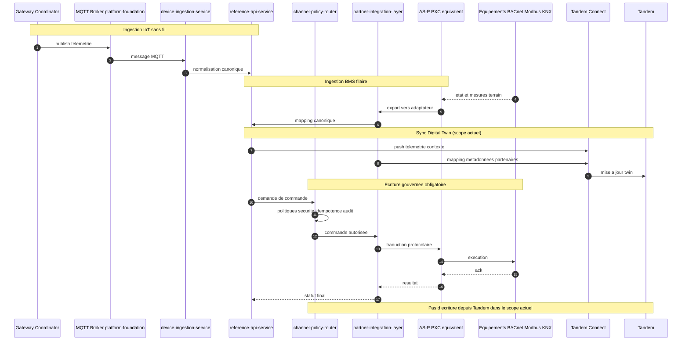

# Option B - Schema Multi-Niveaux (Zoom L0 / L1 / L2)

## L0 - Carte de valeur (executif)

## L1 - Architecture de reference (macro)

## L2 - Flux operationnels (detail)

## Legende scope
- IN SCOPE: LoRaWAN, Zigbee, MQTT, BACnet/Modbus/KNX via partenaires, sync Tandem telemetrie/contexte.
- ROADMAP: Z-Wave, nouveaux partenaires BMS, extensions digital twin futures.
