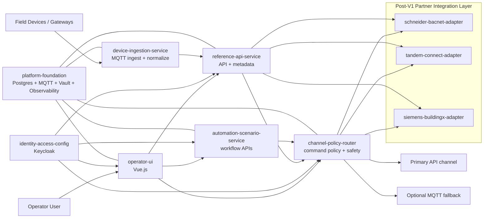
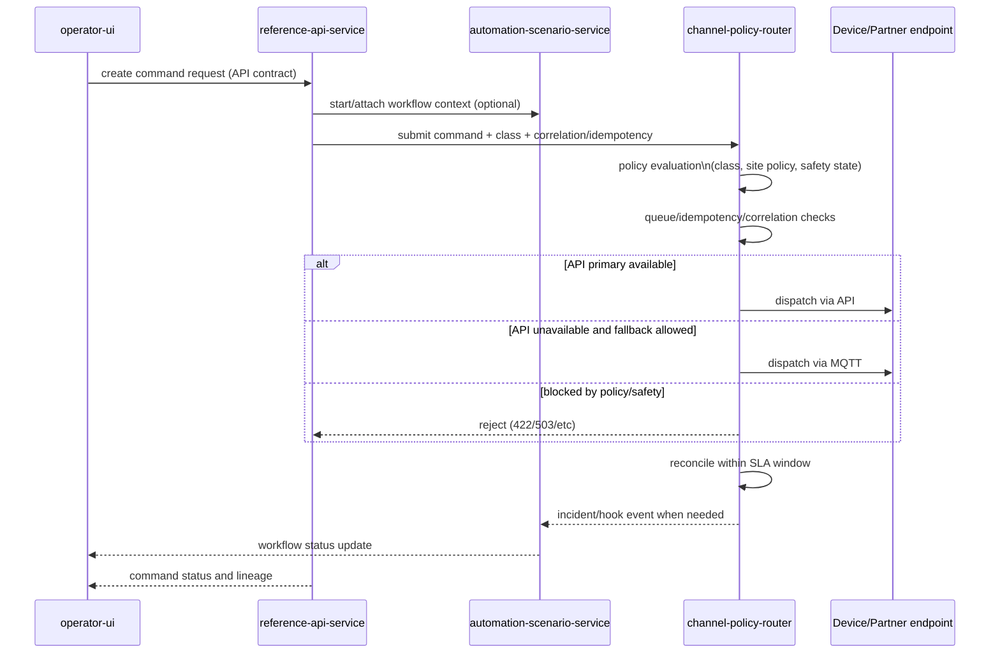

# System Responsibilities And Interactions

This document defines what each repository owns, what it must not own, and how components interact in V1.

## 1. Can `channel-policy-router` run with multiple instances?

Yes.

`channel-policy-router` is designed to run with multiple instances for high availability and scaling. The lease mechanism avoids duplicate batch processing (for SLA evaluation and incident-hook delivery) when two instances are active at the same time.

Typical concurrency situations:
- Horizontal scaling (`replicas > 1`)
- Rolling deployments (old and new pods overlap)
- Scheduler overlap or duplicate trigger
- Manual trigger while scheduler is running

## 2. Responsibility Map (By Repository)

## 2.1 `plateform-meta-iot` (meta-repo)

Owns:
- Architecture governance
- Migration waves and ADR-level decisions
- Cross-repo contracts/governance docs
- Multi-repo operating model and standards

Does not own:
- Runtime business logic of services
- Service-level production data

## 2.2 `platform-foundation`

Owns:
- Shared runtime infrastructure (networking, broker, redis, postgres hosting, vault, observability stack)
- Environment bootstrap patterns and baseline security defaults

Does not own:
- Domain behavior of business services

## 2.3 `identity-access-config`

Owns:
- Keycloak realm/client/role/policy configuration
- Identity and access policy baseline

Does not own:
- Custom authentication engine in application code

## 2.4 `device-ingestion-service`

Owns:
- MQTT ingestion from field/device channels
- Normalization and validation of incoming telemetry
- Deduplication and persistence of raw/normalized measurements
- Dead-letter handling for malformed/unprocessable payloads

Does not own:
- End-user workflow orchestration
- Channel fallback policy for outbound command execution

## 2.5 `reference-api-service`

Owns:
- API-first access to reference and operational data
- Point/equipment mapping metadata
- Command API contracts exposed to operator and integrations
- Tenant/site scoped access checks at API boundary

Does not own:
- Direct MQTT ingestion runtime
- Workflow engine runtime coupling

## 2.6 `channel-policy-router`

Owns:
- Command policy matrix and channel selection
- API-primary / MQTT-fallback routing policy
- Safety-aware queueing, idempotency, correlation, reconciliation
- Incident creation + incident-hook delivery retry/backoff
- Batch operations guard via lease lock (SLA evaluator, hook delivery)

Does not own:
- UI orchestration screens
- Device telemetry ingestion

## 2.7 `automation-scenario-service`

Owns:
- Operational workflow state and orchestration APIs
- Approval/incident/reissue workflow lifecycle
- Correlation and lineage propagation across user workflows
- Camunda integration boundary (TypeScript worker), while core business logic remains Python

Does not own:
- Channel dispatch policy
- Telemetry ingestion and protocol parsing

## 2.8 `operator-ui`

Owns:
- User-facing operational workflows (approvals, incidents, reissue, governance screens)
- API-driven UX (no direct SQL)

Does not own:
- Domain business logic persistence
- Security policy enforcement logic (delegated to APIs + Keycloak)

## 2.9 Post-V1 partner adapters

- `schneider-bacnet-adapter`
- `tandem-connect-adapter`
- `siemens-buildingx-adapter`

Owns:
- Partner-specific ACL/adapter code and protocol translation

Does not own:
- Core command policy/safety model
- Core tenancy and IAM model

## 3. End-to-End Interaction Graph (V1 + Post-V1 adapter slot)

## 4. Command Path Interaction (Detailed)

## 5. Separation-Of-Concerns Rules

1. Each service owns its data model and migrations.
2. Services interact via explicit contracts (OpenAPI/events), not shared tables.
3. UI never bypasses services to hit databases directly.
4. Partner protocols are isolated in adapters; core platform remains protocol-agnostic.
5. Channel policy stays centralized in `channel-policy-router`.

## 6. Practical Operational Notes

1. Multi-instance operation is expected for `channel-policy-router`.
2. Lease lock is required for batch jobs to prevent duplicate processing.
3. If lease cannot be acquired, worker exits cleanly and next cycle retries.
4. Incident-hook delivery is retried with backoff, not silently dropped.
